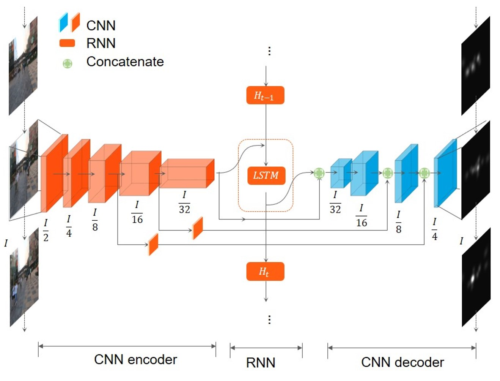
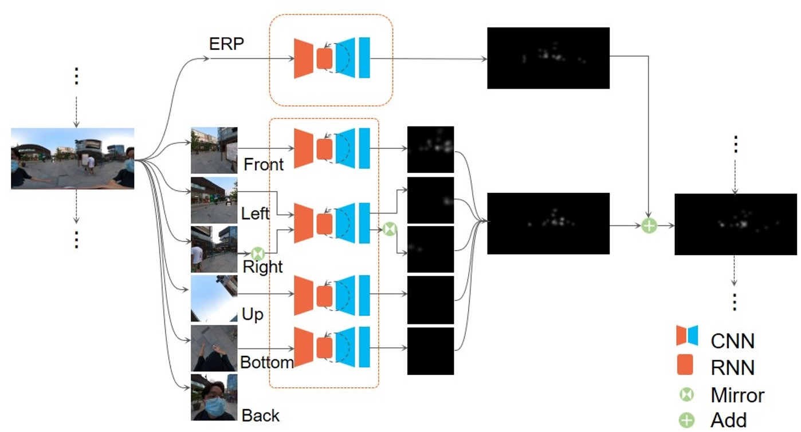

## Predictive modeling of pedestrians' visual attention in urban environment using 360° video

This is code and dataset of the paper "Entropy-Based Guidance and Predictive Modelling of Pedestrians’ Visual Attention in Urban Space"

### Visualization Demo
Visualization of 120°-front-view model (top-ground truth, bottom-prediction)

Visualization of 360° model (top-ground truth, bottom-prediction)

### Model Architecture
A cnn-rnn architecture is used for both models.

The architecture of 120°-front-view model:

The architecture of 360° model:

### Evaluation

### Environment

python>=3.8.16

torch >=2.0.1

opencv-python>=4.7.0.72

### Dataset

* Dataset of 120°-front-view <a href="https://cloud.tsinghua.edu.cn/f/e0038a4d705e4c179195/?dl=1">[Download]</a>

* Dataset of 360° <a href="https://cloud.tsinghua.edu.cn/f/b4668e18cd8445a7b438/?dl=1">[Download]</a>

### Train

To train 120°-front-view model, run: main_train.py

To train 360° model, run: mian_train_360.py
